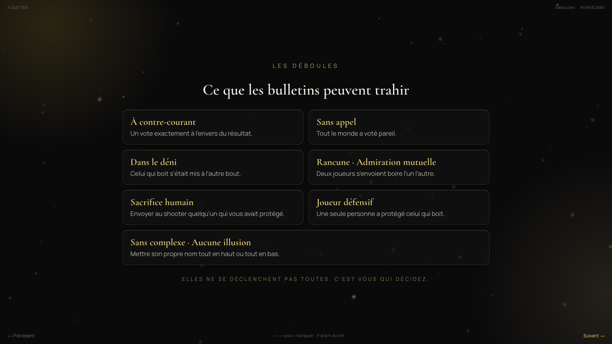
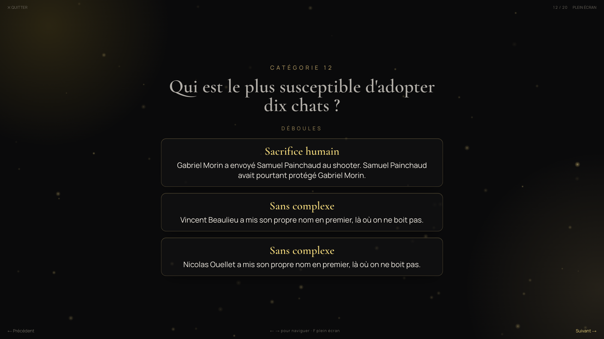
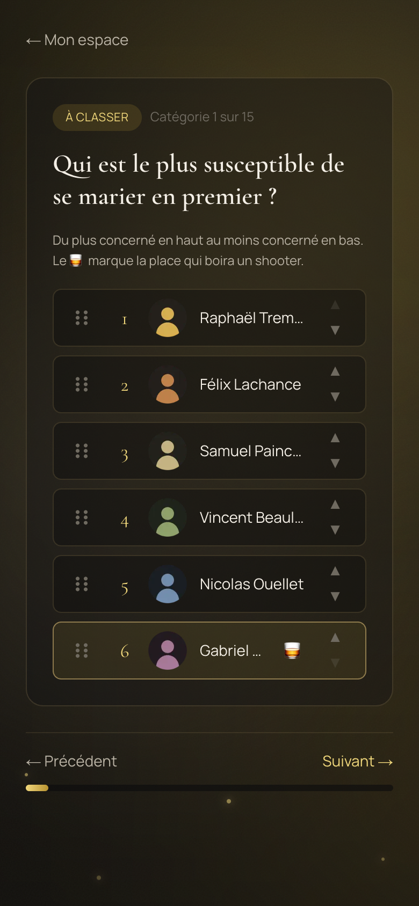

# Les Brunos

[](https://github.com/jeremygenereux/Brunos/actions/workflows/ci.yml)

Application web du gala annuel des **Brunos** : une remise de prix entre amis où
l'on vote _who's most likely to_, où les classements décident qui boit quoi, et
où les résultats sont dévoilés sur grand écran, façon Oscars.

En production sur **[brunos.live](https://brunos.live)** — application privée,
sur invitation, non indexée.

> Ce dépôt est public à titre de portfolio. Il n'est **pas** open source :
> voir [`LICENSE`](LICENSE). Les personnes, les lieux et les votes du jeu de
> démonstration sont fictifs.

> **In English** — Web app for a private annual awards night: friends rank each
> other in _who's most likely to_ categories, a Borda count turns the ballots
> into standings, the standings decide who drinks what, and the results are
> revealed on a big screen. Built with Next.js 16, React 19 and Supabase, with
> row-level security on every table and the scoring logic kept pure and tested.
> The interface, the code comments and the rest of this README are in French.

## Aperçu

L'application est privée : ces captures viennent du jeu de démonstration, dont
les personnes, les portraits et les votes sont fictifs.


Le verdict d'une catégorie. Les gorgées montent avec le rang, les ex æquo
occupent **une** position et boivent la même chose, et la personne qui prend le
shooter arrive en dernier — jamais devinable par élimination.




Ce que les bulletins trahissent, annoncé au début puis révélé après chaque
verdict. Le catalogue est filtré sur les règles réellement en jeu ce soir-là :
on ne promet jamais une déboule impossible.



Le bulletin, sur téléphone. Le classement se fait au glisser-déposer ou aux
flèches, et le verre marque la place qui paiera un shooter.

---

## Ce que fait l'application

Une **édition** (un gala) traverse six états, dans cet ordre :

```
CONSTRUCTION → SENT_FOR_VOTE → COMPILATION → LOCKED → LIVE → ARCHIVED
   on écrit       on vote       on dépouille   on gèle  on présente  c'est public
```

Cet enchaînement n'est pas décoratif, il est appliqué en base.
`edition_accepts_votes()` n'autorise l'écriture d'un bulletin que dans l'état
`SENT_FOR_VOTE` et avant l'échéance ; le mode présentation ne lit **que** les
résultats figés au passage en `LOCKED`. Le soir du gala, aucun calcul ne peut
donc changer sous les pieds de l'assemblée.

### Les catégories

Chaque catégorie porte un **format**, qui décide de ce qu'on demande au votant,
et une **règle de gorgées**, qui décide de ce que ça coûte.

| Format          | Le votant…                           | Agrégation              |
| --------------- | ------------------------------------ | ----------------------- |
| `ranking`       | classe tous les nommés, du 1ᵉʳ au Nᵉ | Borda (somme des rangs) |
| `single_choice` | désigne une seule personne           | décompte des voix       |

La règle **découle du format**, imposée en base par déclencheur : une désignation
et un classement ne peuvent pas se comporter pareil.

| Règle                | S'applique à    | Qui prend le shooter | Et les autres                   |
| -------------------- | --------------- | -------------------- | ------------------------------- |
| `TOP_UNIQUE`         | `single_choice` | le plus voté         | rien du tout                    |
| `ESCALATION`         | `ranking`       | le dernier           | 1 gorgée au 1ᵉʳ, 2 au 2ᵉ, etc.  |
| `ESCALATION_INVERSE` | `ranking`       | le premier           | les suivants boivent en montant |

Les deux variantes de classement punissent la même personne ; seul l'énoncé
change de sens (« qui est le plus susceptible de… » contre « qui est le moins… »).

Un shooter vaut un nombre de gorgées configurable par édition (8 par défaut), ce
qui rend les charges comparables d'une catégorie à l'autre.

### Les ex æquo

Deux joueurs au même total de Borda sont **ex æquo, sans départage**, et boivent
exactement la même chose — shooter compris, sans plafond sur le nombre de
co-gagnants. Le classement porte donc deux rangs : `final_rank`, distinct par
construction, n'ordonne que l'affichage ; `tied_rank` est le rang de compétition
(1, 2, 2, 4), partagé, et c'est lui seul qui décide des gorgées. Calculer sur le
rang d'affichage laissait un hachage d'identifiant désigner qui calait.

### Les cercles

Une personne peut appartenir à plusieurs cercles, et chaque cercle a son propre
palmarès : archive, trophées et carrières sont cloisonnés, les gorgées de l'un
ne s'additionnent jamais à celles de l'autre.

### L'égaliseur

Le point le moins évident du projet. À la compilation, l'administration retient
_k_ catégories parmi celles qui ont été votées. Ce choix décide de qui boit
combien sur la soirée entière, et un mauvais choix donne une soirée où une seule
personne encaisse tout.

[`src/lib/scoring/equalizer.ts`](src/lib/scoring/equalizer.ts) résout ce
problème : amorce gloutonne puis recuit simulé sur un générateur pseudo-aléatoire
à graine, pour minimiser l'écart max−min des totaux par joueur. Déterministe à
graine égale, et jamais pire que l'amorce. Il ne connaît que des vecteurs de
gorgées, jamais des formats, ce qui le rend indifférent à l'ajout de nouveaux
types de catégories.

### La révélation

La soirée s'ouvre sur les joueurs, puis le règlement, puis le catalogue des
déboules qui peuvent tomber — filtré sur les règles réellement présentes, pour
ne jamais annoncer l'impossible. Chaque catégorie déroule ensuite sa cascade en
réservant l'avant-dernière position pour la fin : sans cela, la dernière
personne serait devinable par élimination. Après le verdict viennent les
déboules, puis une flèche par votant vers la personne qu'il a envoyée boire.

[`src/lib/editions/drama-cards.ts`](src/lib/editions/drama-cards.ts) détecte
neuf déboules — bulletin à contre-courant, unanimité, déni, rancune ou
admiration réciproque, sacrifice d'un allié, défenseur solitaire,
auto-désignation. Chacune est restreinte à la règle sous laquelle elle a un
sens : se classer mutuellement dernier est une rancune quand le dernier boit,
et une politesse quand c'est le premier. Module pur, un test par déclencheur ;
[`drama.ts`](src/lib/editions/drama.ts) ne fait que lire la base et lui passer
les bulletins. La scène n'affiche que les quatre plus rares, l'archive les
montre toutes.

---

## Stack

- **Next.js 16** (App Router) · **React 19** · **TypeScript**
- **Tailwind CSS v4**
- **Supabase** — Postgres, Auth, Storage, Row Level Security
- **Vitest** pour la logique de calcul
- **Vercel** pour l'hébergement

---

## Prérequis

- **Node.js ≥ 20**
- **pnpm ≥ 9** (`corepack enable`)
- **Docker**, pour la stack Supabase locale

## Démarrage rapide

```bash
pnpm install
cp .env.example .env.local        # puis remplir les clés (voir ci-dessous)

pnpm db:start                     # démarre Supabase en local (Docker)
pnpm db:reset                     # applique les migrations + le seed
pnpm db:types                     # génère src/lib/types/database.types.ts

pnpm dev                          # http://brunos.localhost:3001
```

**Tout-en-un :** `pnpm dev:local` démarre Supabase, ouvre Studio et Mailpit,
puis lance le serveur.

Après `pnpm db:start`, le CLI affiche l'API URL et les clés locales :

| Variable                        | Source                                      |
| ------------------------------- | ------------------------------------------- |
| `NEXT_PUBLIC_SUPABASE_URL`      | `API URL` affichée par `supabase start`     |
| `NEXT_PUBLIC_SUPABASE_ANON_KEY` | `anon key` affichée par `supabase start`    |
| `SUPABASE_SERVICE_ROLE_KEY`     | `service_role key` — **serveur uniquement** |
| `NEXT_PUBLIC_SITE_URL`          | origine publique, pour les liens absolus    |

**Ports dédiés**, pour tourner en parallèle d'un autre projet Supabase :
app **3001** · API **54421** · base **54422** · Studio **54423** · Mailpit **54424**.

Le seed crée quatre éditions, une par état intéressant du cycle de vie, avec des
comptes de démonstration. Identifiants dans l'en-tête de
[`supabase/seed.sql`](supabase/seed.sql).

---

## Scripts

| Script                                | Rôle                                               |
| ------------------------------------- | -------------------------------------------------- |
| `pnpm dev` · `pnpm dev:local`         | Serveur de développement · avec la stack complète  |
| `pnpm build` · `pnpm start`           | Build de production · serveur de production        |
| `pnpm test` · `pnpm test:watch`       | Vitest                                             |
| `pnpm lint` · `pnpm typecheck`        | ESLint · vérification des types                    |
| `pnpm format` · `pnpm format:check`   | Prettier                                           |
| `pnpm db:start` · `pnpm db:stop`      | Stack Supabase locale                              |
| `pnpm db:reset`                       | Ré-applique les migrations puis le seed            |
| `pnpm db:diff <nom>`                  | Génère une migration depuis les changements locaux |
| `pnpm db:types`                       | Régénère les types TypeScript du schéma            |
| `pnpm db:history` · `pnpm db:restore` | Réimporte des éditions depuis des exports CSV      |

L'intégration continue ([`.github/workflows/ci.yml`](.github/workflows/ci.yml))
exécute lint, typecheck, tests et build sur `main`, `develop` et chaque PR.

---

## Structure

```
src/
  app/                    # Routes App Router
    (auth)/               # connexion, inscription
    account/              # tableau de bord du participant
    admin/                # cercles, répertoire, éditions, compilation, présentation
    vote/[editionId]/     # le bulletin
    archive/              # palmarès, publics une fois l'édition archivée
    robots.ts             # noindex : l'app n'a rien à faire dans un moteur
  components/             # avatar, pictogrammes, primitives d'interface
  lib/
    scoring/              # Borda, gorgées, égaliseur — logique pure, testée
    editions/             # cycle de vie, gel des résultats, présentation, déboules
    dates/                # heures de salle, épinglées sur America/Toronto
    supabase/             # clients navigateur / serveur / service_role, pagination
  proxy.ts                # convention Next 16 (ex-« middleware »)
supabase/
  migrations/             # source de vérité du schéma
  seed.sql                # jeu de démonstration
docs/                     # spécification MVP + idées post-MVP
```

Le calcul vit dans `src/lib/scoring`, sans dépendance à React ni à Supabase.
C'est ce qui permet de le tester à froid, et ça compte : les gorgées figées
alimentent l'archive à vie. Une erreur y passerait inaperçue le soir même et se
verrait deux ans plus tard dans le palmarès.

---

## Accès et comptes

L'application est **sur invitation** et **n'envoie aucun courriel**. C'est un
choix assumé : payer un service d'envoi à l'année pour une application ouverte
deux fois n'a pas de sens. L'administration crée l'accès d'une personne depuis
le répertoire, ce qui génère un mot de passe lisible à voix haute, affiché une
seule fois et conservé nulle part. La confirmation d'adresse est court-circuitée
côté Supabase : l'identifiant ne sert qu'à identifier, il n'a pas besoin de
recevoir quoi que ce soit.

---

## Environnements et branches

| Git         | Environnement  | Vercel     | Supabase                          |
| ----------- | -------------- | ---------- | --------------------------------- |
| `main`      | **Production** | Production | migrations appliquées à la fusion |
| `develop`   | Intégration    | Preview    | même projet                       |
| `feature/*` | éphémère       | Preview    | même projet                       |

- Travail sur des branches **`feature/*`** → PR vers **`develop`** → PR vers **`main`**.
- Commits en **Conventional Commits**.
- Les migrations sont appliquées par l'**intégration GitHub de Supabase** à la
  fusion sur `main`. **Vercel ne touche jamais à la base.**
- Il n'y a **qu'un seul projet Supabase**. Le schéma est prêt pour le
  _branching_ — migrations versionnées, aucun état hors migration — mais
  celui-ci demande le plan Pro et n'est pas activé.

---

## Sécurité et confidentialité

- **Row Level Security sur toutes les tables**, en `FORCE`, avec des fonctions
  d'aide `SECURITY DEFINER` (`is_admin_of_edition`, `current_person_id`,
  `is_edition_participant`). Aucune politique n'accorde quoi que ce soit au rôle
  `anon`.
- Un votant ne voit **jamais** les bulletins d'autrui avant l'archivage de
  l'édition. Un bulletin envoyé n'est plus modifiable, y compris via l'API.
- Les écritures sensibles passent par des fonctions `SECURITY DEFINER` qui
  vérifient les droits elles-mêmes, plutôt que de faire confiance au client.
- La clé `service_role` est **serveur uniquement**, jamais exposée au navigateur.
- L'application est écartée des moteurs de recherche par `robots.txt` **et** par
  un en-tête `X-Robots-Tag: noindex` sur toutes les routes. La confidentialité
  réelle ne repose sur aucun des deux : sans session, RLS ne rend rien.
- `.env.local` est ignoré par Git.

---

## Documentation

- [`docs/BRUNOS_MVP_SPEC.md`](docs/BRUNOS_MVP_SPEC.md) — spécification complète
- [`docs/BRUNOS_FUTURE_FEATURES.md`](docs/BRUNOS_FUTURE_FEATURES.md) — idées
  post-MVP, chiffrées et priorisées

---

## Licence

© 2026 Jérémy Généreux. Tous droits réservés. Dépôt public à titre de portfolio,
sans licence d'utilisation. Voir [`LICENSE`](LICENSE).
